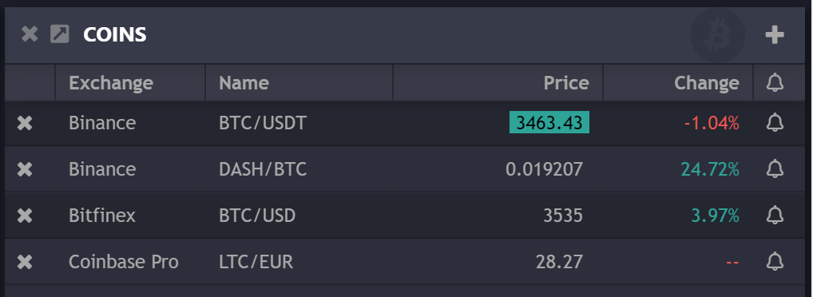
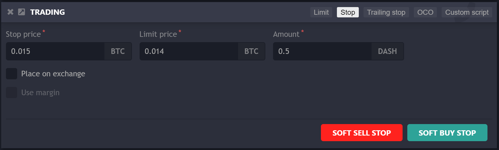
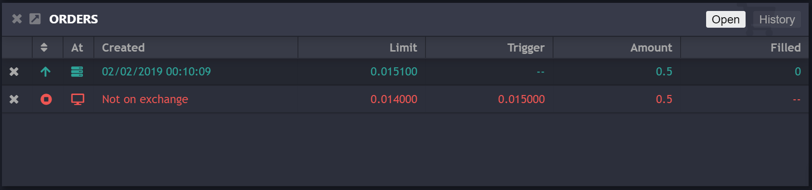
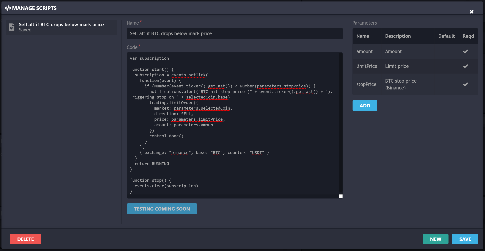
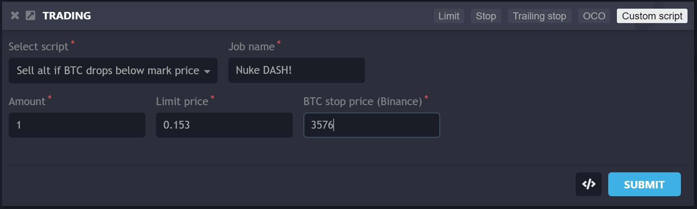

Here are just a few things that you can do with Orko, on any exchange, all while tracking everything from multiple computers, mobile devices and tablets:

# Place a limit order, get a push notification when it fills

Orko detects any trades made on coins it's tracking. If you've provided you [telegram details](Local-installation) it will send you a push notification on any fills. If you have the web app open, you'll get a desktop notification.

# Enter a trade, track your profit

You can easily set a **reference price** on any tracked coin and see the price change as a percentage.  Never forget to take profit again.

# Set a buy and a stop loss at the same time

Either place stops on the exchange, locking your balance, or off-exchange, on the Orko server.

This allows you to place both a buy and a stop loss beneath the buy price.

# Sell your alts when BTC's price drops

Using [scripting](Scripting), you can start to do really interesting things.  A really simple and powerful script is to use BTC's price to drive a stop-loss on a completely different coin:

Save it and then use it any any coin you're looking at, just like any other trade type.

There's a lot more to discover.  Have you done something awesome with Orko?  Please let us know!